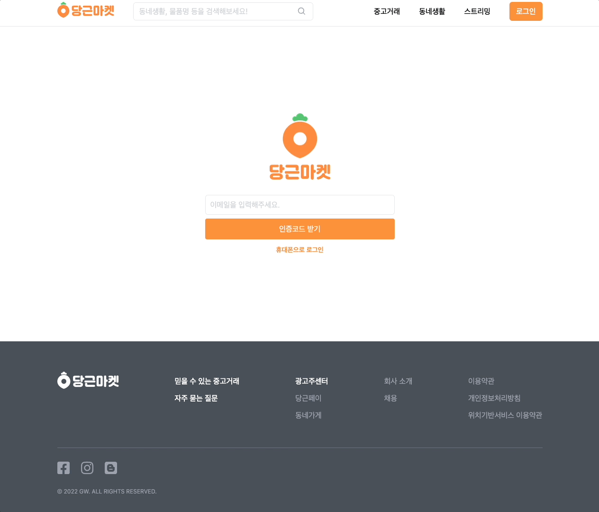
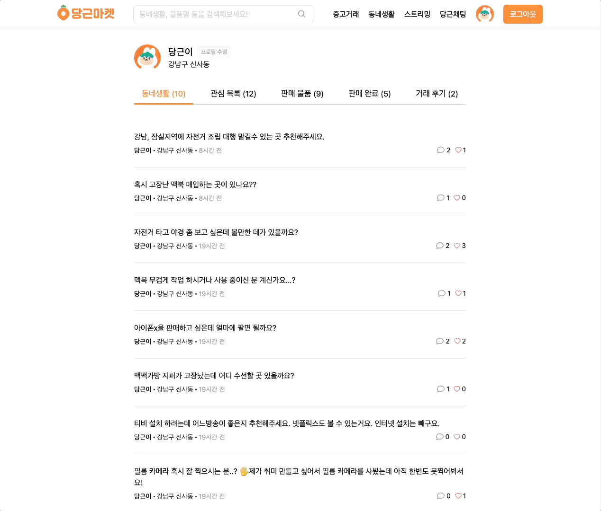
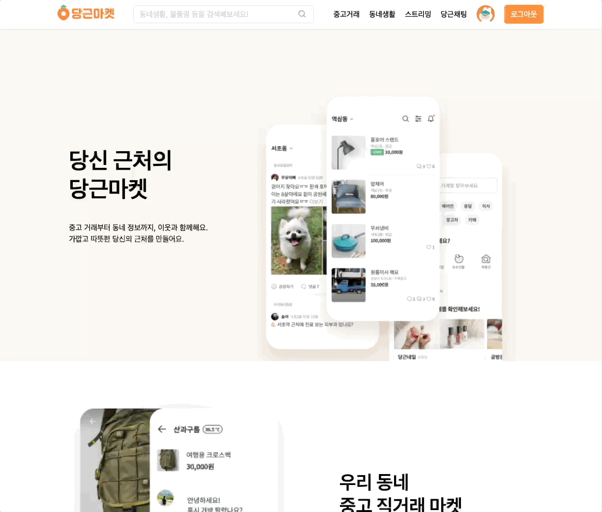
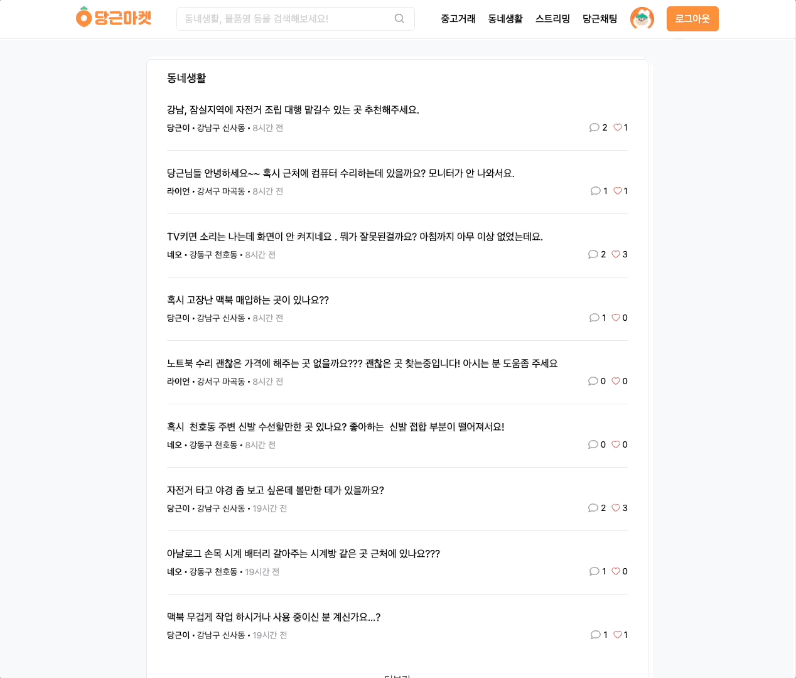
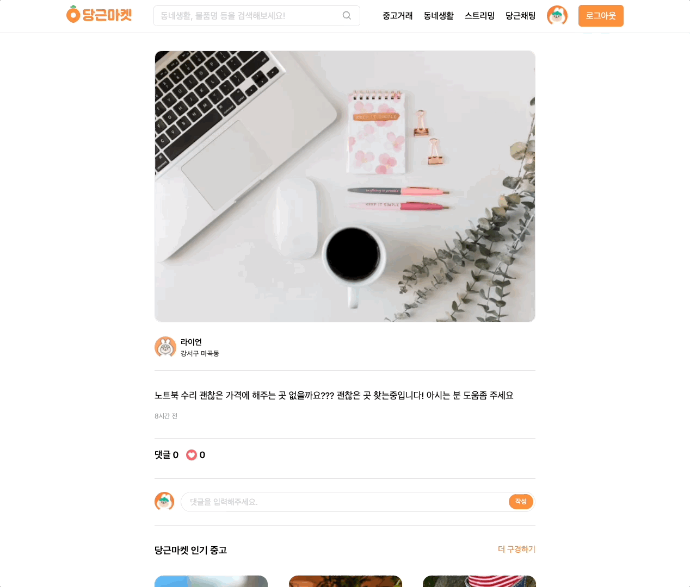
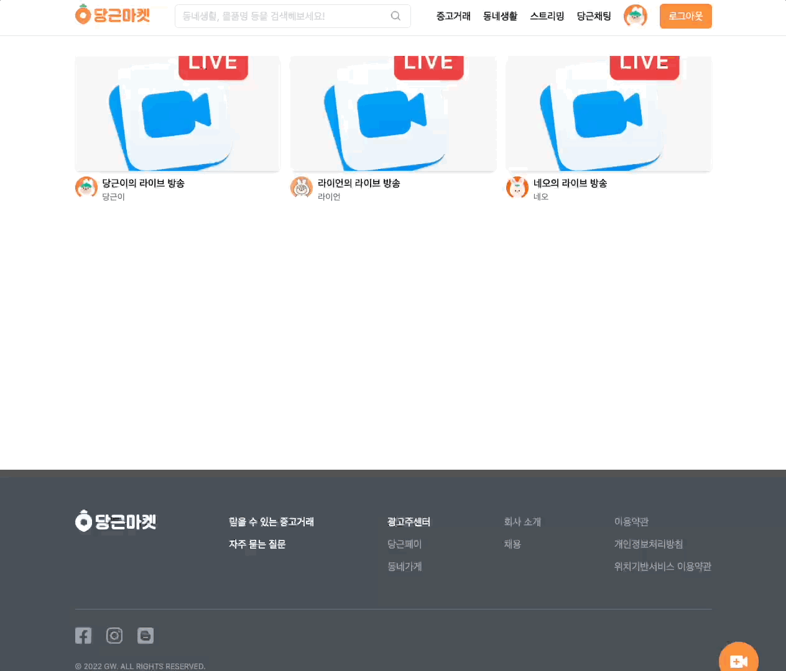
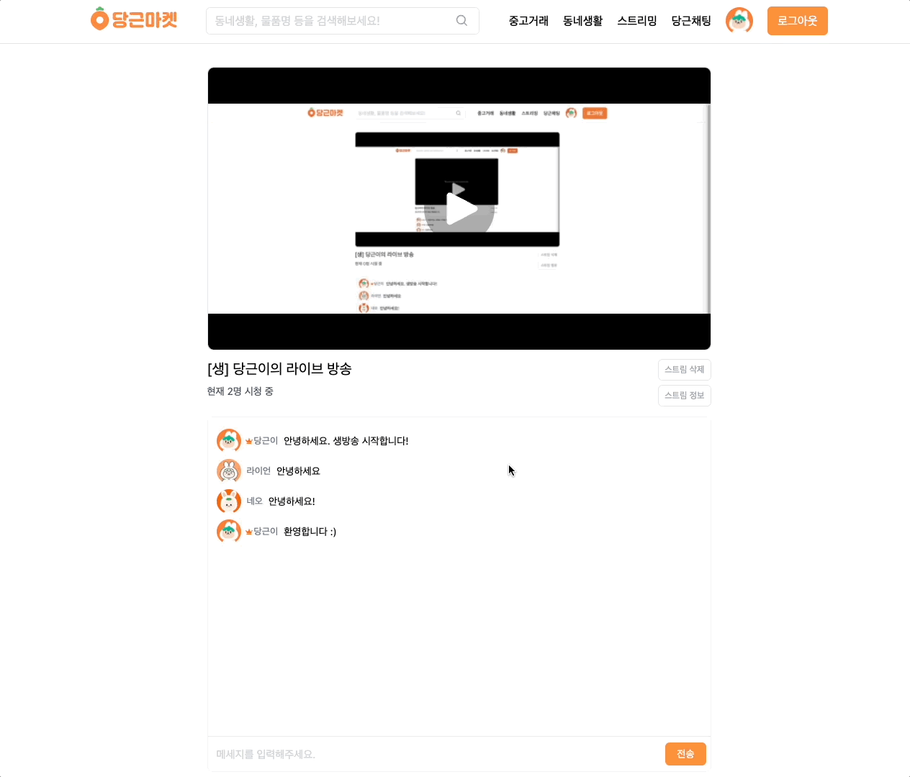
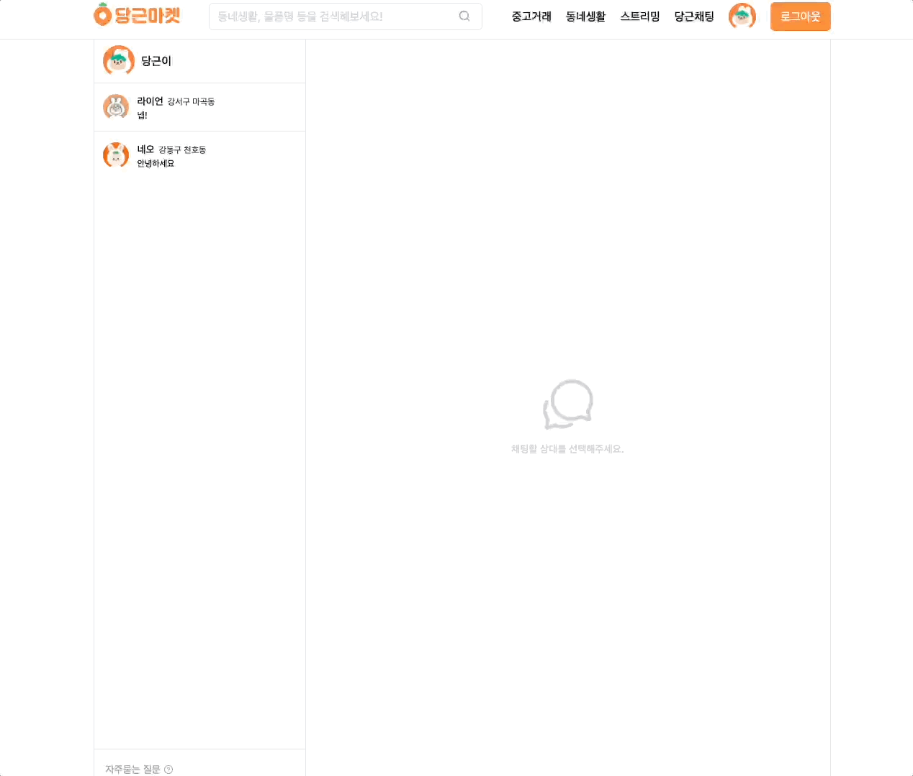
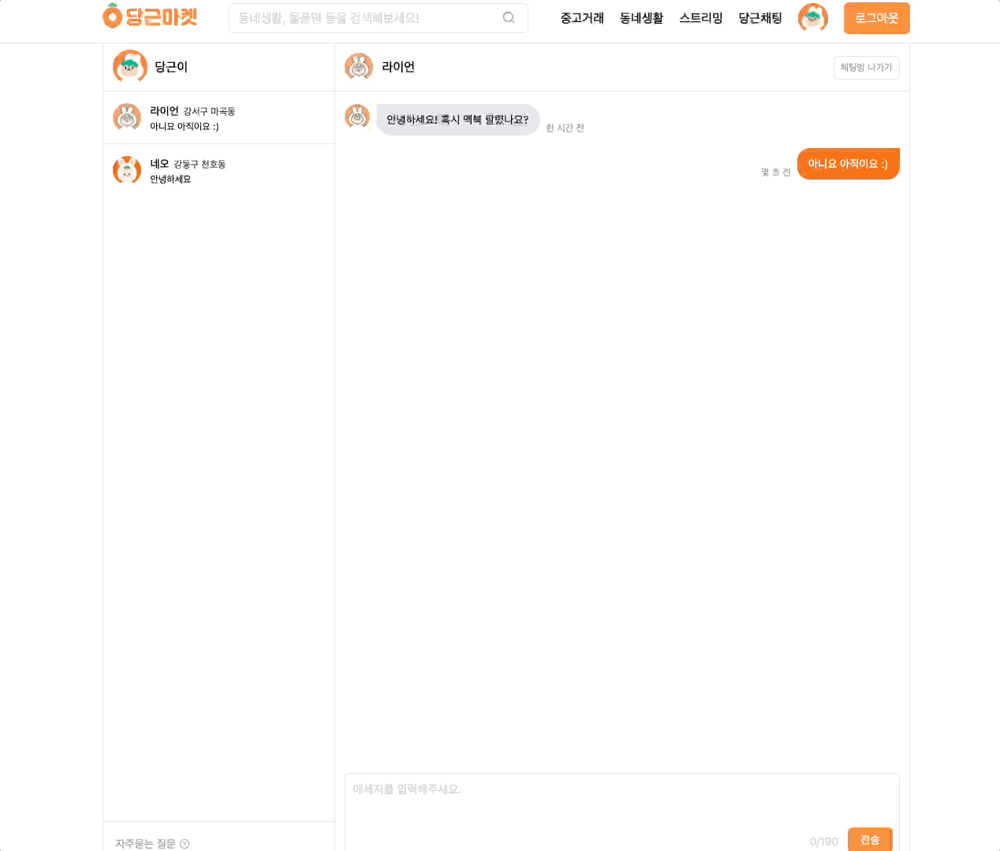

  <a href="https://danggeun-market.vercel.app">
    
      
    <a display="block" href="https://danggeun-market.vercel.app">https://danggeun-market.vercel.app</a>
      
    
  </a>

## Table of contents

- 🔥 [Built with](#built-with)
- 🌈 [Project](#project)
- 📑 [Pages](#pages)
- ⚙ [Features](#features)
- 📝 [License](#license)

## Built with

### Front-end

- `NextJS`
- `React`
- `Typescript`
- `SWR`
- `TailwindCSS`

### Back-end

- `PlanetScale`
- `Prisma`
- `Twilio`
- `SendGrid`
- `Iron Session`
- `Cloudflare Images`
- `Cloudflare Stream`

### Deploy

- `Vercel`
- `PlanetScale`
- `Cloudflare`

## Project

> 1. LogIn

- Users can log in using an email or phone number to recieve a verification code. 
- For email login, the Twilio SendGrid Email API is used to send the code.
- For phone login, the Twilio Messaging Service is used to send the code. 
- Upon succesful verification, Iron Session stores encrypted sessiond ata in cookies. 
- This encrypted session data can only be decrypted on the server side. 
    
  

> 2. Profile

- Users can view and edit their profile photo, name, email, and phone number.
- Tabs like Neighborhood Life and Favorites allow users to view their posts or favorite items.
- Tabs for Selling and Sold let users view active and completed listings.
- Users can view or leave reviews and ratings through the Review tab.
    
  

> 3. Products and Post Search

- Users can search products by name.
- Users can search posts by content.
    
  

> 4. Products

- View all items listed in the secondhand marketplace.
- Load more products with the "See more" option.
- Click on a product to view detailed information.
- Upload a product with image, name, price, and description.
- Images are optimized and stored using Cloudflare Images.
    
  

> 5. Product Details

- View images, name, price, description, and like count.
- Like a product to add it to favorites using SWR to update the cache.
- Click "Chat with Seller" to initiate a conversation.
- Sellers can mark items as sold.
- Related products with similar names are displayed.
    
  

> 6. Posts

- View all community posts under "Neighborhood Life".
- Load more posts with "See more".
- Click on a post to view detailed content.
- Create posts by uploading images and writing descriptions.
- Images are optimized and stored using Cloudflare Images.
    
  

> 7. Post Details

- View image, description, comment count, and likes.
- Like a post to add it to favorites and update cache via SWR.
- Add and delete comments.
    
  

> 8. Streaming

- View all streaming sessions.
- Click to view details of a stream.
- Create a stream by entering title and content.
    
  

> 9. Streaming Details

- Watch live or latest streams on the stream details page.
- Streamers can start live streams using server URL and stream key from Cloudflare Stream.
- Live stream pages show current viewers and allow real-time chat.
- After ending, recorded videos are saved and available as latest streams.
    
  

> 10. Chat

- View all chat rooms.
- Click on a chat to view details.
    
  

> 11. Chatting Details

- Chat directly with the product seller.
- After completing a transaction, users can leave the chat room.
    
  

## Pages

> Root

- Home
- Login
- Search

> User

- Neighborhood Life
- Favorites
- Selling
- Sold
- Reviews
- Edit Profile

> Product

- All Products
- Product Details

> Post

- All Posts
- Post Details

> Stream

- ALl Streams
- Stream Details

> Chat

- All Chats
- Chat Details

## Features

### 🙎‍♂️ User

- [x] Login via email or phone
- [x] Logout
- [x] View Profile
- [x] Upload avatar
- [x] Edit profile
- [x] Write review
- [x] Delete review

### 📦 Product

- [x] View all products
- [x] View product details
- [x] Upload product
- [x] Delete product
- [x] Like product
- [x] Search product
- [x] Mark as sold
- [x] Chat with seller

### 📋 Post

- [x] View all posts
- [x] View post details
- [x] Create post
- [x] Delete post
- [x] Like post
- [x] Search post
- [x] Post comments

### 🎥 Stream

- [x] View all streams
- [x] View stream details
- [x] Create stream
- [x] Delete stream
- [x] Stream chat

### 💬 Chat

- [x] View all chats
- [x] View chat details
- [x] Create chat
- [x] Delete chat

## License

<a>MIT</a>
